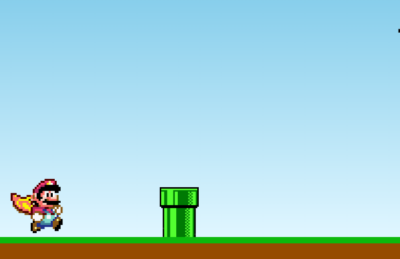
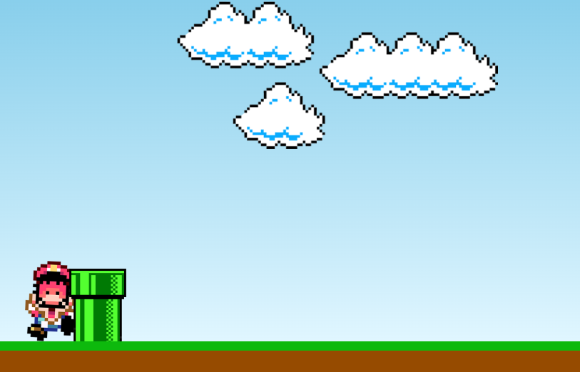

<h1 align="center"> 🍄 Joguinho do Mario 🍄 </h1>

     <h3> Aplicação realizada utilizando javascript puro.</h3>
     
     
      
     
Com base nesse <a href="https://www.youtube.com/watch?v=r9buAwVBDhA&ab_channel=ManualdoDev">tutorial</a>.

     <h2></h2>

+ ### Tecnologias:
     
     
     
         
+ ### IDE:
     
