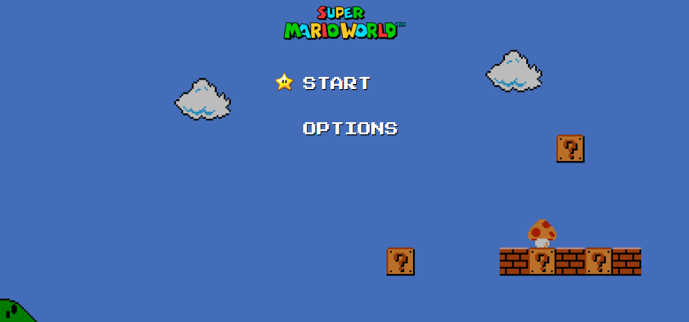
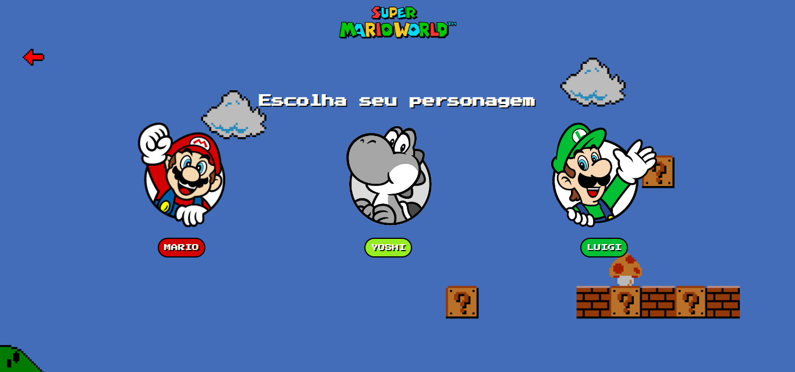
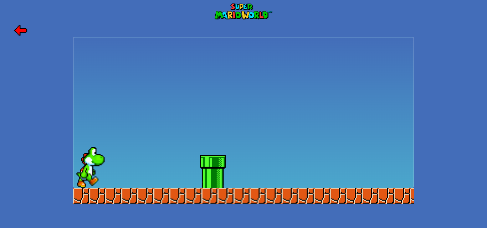

<h2> </h2>

A aplicação consiste em um minijogo do Mario que foi baseada em um tutorial, porém foi melhorado o layout e criado uma tela inicial e uma com seleção de personagens podendo escolher entre Mario, Yoshi e Luigi. 

 

     
     
     

##

### Tecnologias utilizadas:

     
     
     
      

## 

### Links: 
- Link do tutorial utilizado: [Tutorial](https://www.youtube.com/watch?v=r9buAwVBDhA&ab_channel=ManualdoDev)
- Acesso ao game: [Super Mario](https://beatrizaribeiro.github.io/GameSuperMario/index.html)
